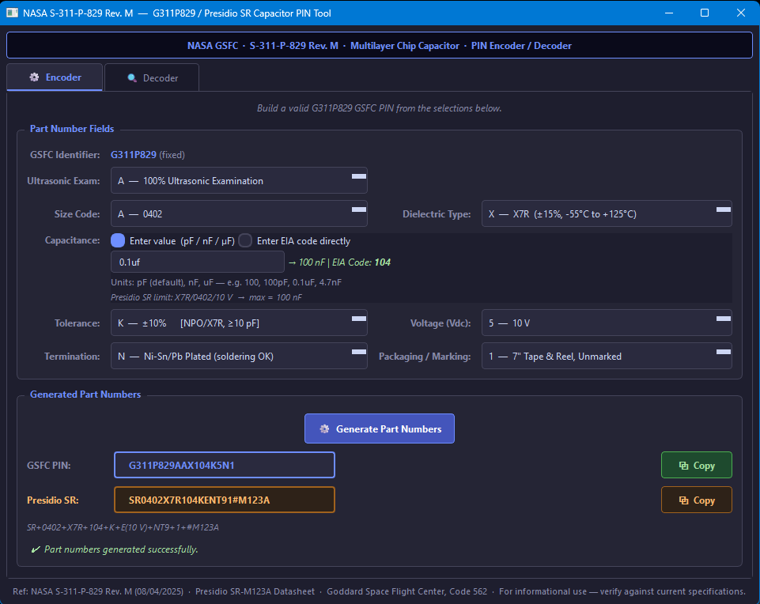

This is a clone from an orginal source at https://repos.kb3gtn.us

# GSFC G311P829 Capacitor Part Number Encoder/Decoder

This is a simple python3 (pyside6) GUI to generate or decode a G311P829 Capacitor part number.
This tool also will generate a part number for a Presidio Component SR series capacitor as cross reference. 

# How to run this program from source

## Windows
You will need python3 (3.9+) installed.   
Clone / Download this repo into a working folder.    
Open a command terminal in the working folder.    
Create a python virtial enviornment using: python -m venv venv    
Enter the virtual environment: .\venv\Scripts\activate.bat  (or activate.ps1 if powershell)    
install requirements using: pip install < requirements.txt    
Then run the program using: python .\G311P829_tool.py     

## Linux
Check that python3 (>=3.9) is installed.  (python3 -version)    
Clone / Download this repo into a working folder.    
Open a terminal into the working folder    
Create a python virtual environment using: python3 -m venv venv    
Note: some linux system you might need to install the python3-venv package to have this module.    
Enter the virtual enviornment (assumes BASH) 'source ./venv/Scripts/activate'     
install requirements into virtual environment using: pip3 install < requirements.txt    
The run the program using: python .\G311P829_tool.py    

# TODO
Build windows Distributable EXE for release.    

